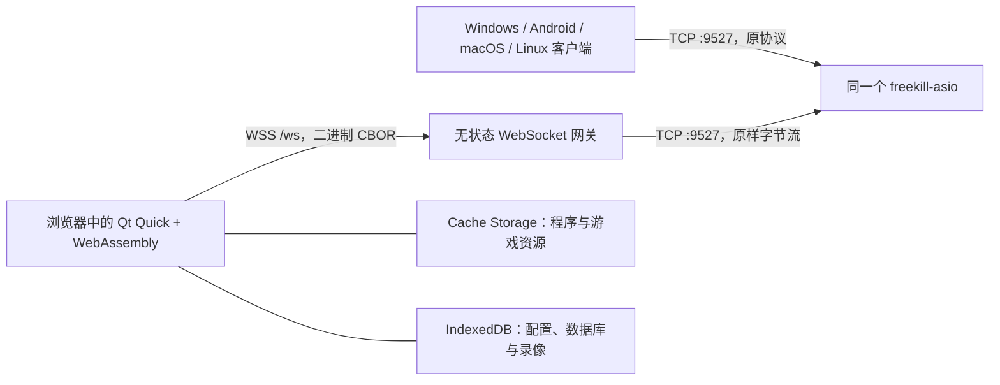

# FreeKill Web

本仓库把 FreeKill 的现有 Qt Quick 客户端编译为 WebAssembly，并让网页端与原生客户端进入**同一个 FreeKill 游戏服务端**。游戏规则、房间、登录、断线重连和录像协议仍由原来的 `freekill-asio` 处理；Web 网关只做 WebSocket 与 TCP 之间的二进制字节转发，不解析、不改写 CBOR，也不保存任何游戏状态。

固定的上游版本：

- `Qsgs-Fans/FreeKill`：`37f8c1248d491f5fbc7a07f1bc53724191e44497`（v0.5.20）
- `Qsgs-Fans/freekill-asio`：兼容 `edb3e43d65006cad1f6737f36510b4a5329c3af2`（v0.1.14）
- `Qsgs-Fans/freekill-core`：`c19441690711b73ffb427b3e7974ec7e92e33bea`

## 架构



浏览器不能直接建立普通 TCP 连接，因此网页客户端用 Qt WebSockets；网关连接既有 TCP 端口。原生客户端无需升级或改变连接方式。

## 已实现内容

- Qt `QTcpSocket` / `QWebSocket` 双传输适配，保持连续 CBOR 数据流语义。
- 固定上游 TCP 目标的安全网关，支持 Origin 白名单、连接上限、心跳、背压、超时和健康检查。
- WebAssembly 专用客户端构建：移除本地服务端、UDP 局域网发现和运行时 `libgit2`，保留 Qt Quick/Lua 游戏逻辑。
- `freekill-core` 在构建时导出为普通文件（不把 `.git` 打进浏览器），并与服务端使用同一提交。
- 首次启动按资源字节数显示缓存进度；后续从 Cache Storage 加载。配置、客户端 SQLite 数据库和录像写入 IDBFS/IndexedDB。
- Nginx 同源 WSS 反向代理、Wasm MIME、预压缩、安全响应头与多线程 Wasm 所需的 COOP/COEP。
- Docker Compose 部署，直接指向已经运行的 `freekill-asio:9527`。

## 1. 测试网关

需要 Node.js 22 或更高版本：

```bash
cd gateway
npm ci
npm test
```

直接启动：

```bash
FREEKILL_HOST=127.0.0.1 \
FREEKILL_PORT=9527 \
ALLOWED_ORIGINS=http://localhost:8080 \
npm start
```

环境变量：

| 变量 | 默认值 | 用途 |
| --- | --- | --- |
| `PORT` | `9528` | 网关 HTTP/WebSocket 端口 |
| `FREEKILL_HOST` | `127.0.0.1` | 现有游戏服务端地址 |
| `FREEKILL_PORT` | `9527` | 现有游戏服务端 TCP 端口 |
| `STATIC_ROOT` | 空 | 可选；设置后网关会同时提供该目录中的网页/Wasm 静态文件 |
| `WS_PATH` | `/ws` | WebSocket 路径 |
| `ALLOWED_ORIGINS` | 空（开发时允许全部） | 逗号分隔的网页 Origin；生产环境必须设置 |
| `MAX_CONNECTIONS` | `2000` | 网页连接上限 |
| `MAX_PAYLOAD_BYTES` | `33554432` | 单个 WebSocket 消息上限 |
| `CONNECT_TIMEOUT_MS` | `10000` | 连接游戏服务端的超时 |

## 2. 构建 WebAssembly 客户端

建议在 Linux 或 WSL2 中构建。需要：

1. Qt 6.8 的桌面 Host Kit；
2. Qt 6.8 **WebAssembly multi-threaded** Kit，需包含 QML、Quick、Multimedia、WebSockets 和 Concurrent；
3. Emscripten **3.1.56**；
4. CMake、Ninja、SWIG、Git、Node.js 22+、Perl、Make、curl、tar 和 unzip。

Qt Host Kit 与 Wasm Kit 必须是同一个 Qt 补丁版本。激活 emsdk 后运行：

```bash
export QT_HOST_PATH=/opt/Qt/6.8.3/gcc_64
export QT_WASM_ROOT=/opt/Qt/6.8.3/wasm_multithread
./scripts/build-wasm.sh
```

脚本会：

1. 拉取并校验固定的 FreeKill 与 freekill-core 提交；
2. 应用 `overlays/freekill` 中的 Web 适配；
3. 为 Wasm 编译 Lua、SQLite 和 OpenSSL 静态库；
4. 构建 FreeKill；
5. 生成 `dist/`、资源版本清单以及 gzip/Brotli 预压缩文件。

若服务端启用了额外扩展包，先把与服务端完全相同的、已导出的扩展包目录放在一个目录下，然后设置：

```bash
export EXTRA_PACKAGES_DIR=/srv/freekill-web-packages
./scripts/build-wasm.sh
```

目录结构应为 `EXTRA_PACKAGES_DIR/<包名>/...`。浏览器沙箱中不执行 `git clone`；扩展包必须在构建时进入资源包。否则登录时的脚本 MD5 不一致，网页端会明确提示缺少的包。

## 3. 连接同一个服务端

先照常运行现有服务端，例如：

```bash
./freekill-asio -p 9527
```

构建出 `dist/` 后，在本仓库根目录启动：

```bash
FREEKILL_HOST=host.docker.internal \
FREEKILL_PORT=9527 \
PUBLIC_ORIGIN=http://localhost:8080 \
docker compose up --build
```

打开 `http://localhost:8080`。此时：

- 原生客户端仍连接 `<服务器>:9527`；
- 网页连接同源 `/ws`；
- 网关再连接同一个 `<服务器>:9527`；
- 两类玩家处于同一个大厅和房间系统中。

Linux 上如果 `freekill-asio` 也在 Docker 网络中，可把 `FREEKILL_HOST` 改为它的 Compose 服务名。生产环境应使用 HTTPS；HTTPS 页面只能连接 WSS，仓库中的同源 Nginx 配置会自动完成升级代理。

## 不使用 Docker 的服务器部署

网关也可以直接提供 `dist/`，适合已有 FreeKill 服务且暂时不能修改系统 Nginx 的服务器：

```bash
cd gateway
npm ci --omit=dev
HOST=0.0.0.0 PORT=9580 \
STATIC_ROOT="$HOME/freekill-web/dist" \
FREEKILL_HOST=127.0.0.1 FREEKILL_PORT=9527 \
npm start
```

`deployment/systemd/` 提供游戏服务和网页网关的用户级 systemd 单元；
`deployment/nginx-freekill.conf` 可在具备 root 权限后把现有 HTTPS 域名切换到网页网关。

## 缓存行为

`scripts/package-web.mjs` 为每个构建生成含 SHA-256 修订号和文件大小的 `asset-manifest.json`。首次访问时，启动器先缓存 Qt loader、JavaScript、Wasm 和 `.data` 游戏资源，再启动游戏。新版部署会产生新的 Cache Storage 名称，缓存完成后删除旧版本。

客户端配置、SQLite 数据库和录像使用 `/persistent` IDBFS 挂载点，写入后同步到 IndexedDB。清除站点数据会同时清除这些本地数据。

## 目录

```text
gateway/                 WebSocket → TCP 网关及端到端测试
overlays/freekill/       FreeKill 的 WebAssembly 专用源码
scripts/                 上游适配、Wasm 构建、发布打包
web/                     启动页、缓存器、Service Worker
deployment/              Nginx 和容器部署
compose.yaml             网页与网关编排
```

## 当前边界

- 网页构建与一个具体服务端的核心/扩展包集合绑定；服务端换包后要重新构建网页资源。
- Qt Multimedia 在 Qt for WebAssembly 中仍有平台差异，浏览器可能要求用户交互后才允许播放声音。
- 首次资源包较大，这是完整 Qt Quick 客户端和素材进入浏览器文件系统的代价；Nginx 会优先发送预压缩文件，后续访问走本地缓存。
- 网关不是通用 TCP 代理，目标地址由服务端环境变量固定，浏览器不能指定任意内网目标。

项目继续遵循上游 GPL-3.0-or-later 许可证要求；部署修改版时应同时提供对应源代码。
